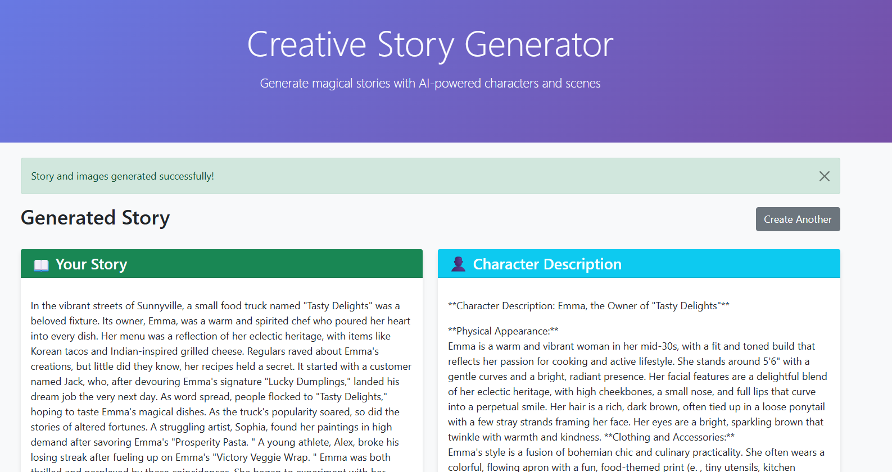
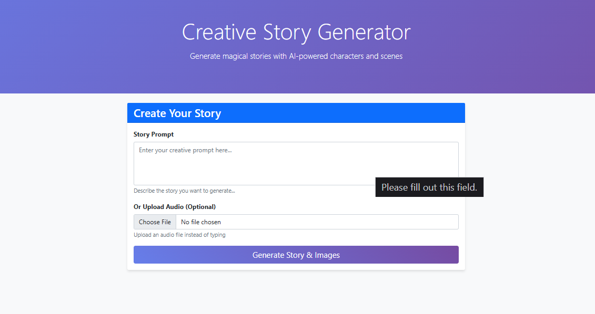
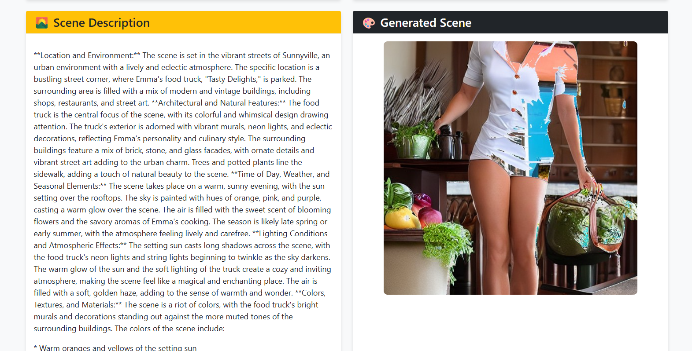
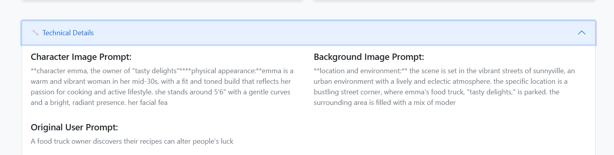

# 🎨 Creative Story Generator

[](https://www.python.org/downloads/)
[](https://djangoproject.com/)
[](https://opensource.org/licenses/MIT)
[](https://groq.com/)

A sophisticated Django-based web application that transforms simple prompts into immersive stories with AI-generated visuals and audio transcription capabilities. Powered by cutting-edge AI models including Groq's LLaMA, Stable Diffusion, and OpenAI's Whisper.

## ✨ Features

### 🎭 Story Generation
- **Advanced AI Storytelling**: Generate engaging, family-friendly stories using Groq's powerful LLaMA models
- **Rich Narrative Creation**: Produces vivid characters, immersive settings, and compelling story arcs
- **Multiple Model Support**: Choose from various production and preview models for optimal performance

### 🖼️ Image Generation
- **Character Visualization**: Create detailed character illustrations based on story descriptions
- **Scene Backgrounds**: Generate atmospheric backgrounds that complement your story
- **Smart Image Composition**: Automatically combine characters and backgrounds into cohesive scenes
- **Fallback Systems**: Robust error handling with beautiful placeholder generation

### 🎵 Audio Processing
- **Multi-format Support**: Accept various audio formats (WAV, MP3, M4A, OGG, FLAC, AAC)
- **Voice-to-Story**: Transform spoken ideas into written stories via Whisper transcription
- **CPU Optimized**: Efficient processing even on standard hardware

### 🔧 Technical Excellence
- **LangChain Integration**: Sophisticated prompt engineering and chain management
- **Modular Architecture**: Clean separation of concerns with dedicated services
- **Production Ready**: Comprehensive error handling and logging
- **Responsive Design**: Beautiful Bootstrap-powered interface

## 🏗️ Architecture

```
📦 Creative Story Generator
├── 🎯 story_generator/
│   ├── 📝 langchain_service.py    # Groq AI integration with LangChain
│   ├── 🎨 image_service.py        # Stable Diffusion image generation
│   ├── 🎵 audio_service.py        # Whisper audio transcription
│   ├── 🌐 views.py               # Django request handling
│   ├── 📋 forms.py               # Form validation and processing
│   ├── 💾 models.py              # Database models
│   └── 🎨 templates/             # HTML templates
├── 📚 requirements.txt           # Python dependencies
└── ⚙️ manage.py                 # Django management script
```

## 🤖 AI Models & Services

### Story Generation (Groq API)
| Model | Type | Context | Tokens | Best For |
|-------|------|---------|--------|----------|
| `llama-3.3-70b-versatile` | Production | 131k | 32k | Complex creative writing |
| `llama-3.1-8b-instant` | Production | 131k | 131k | Fast, balanced responses |
| `gemma2-9b-it` | Production | 8k | 8k | Reliable creative tasks |
| `deepseek-r1-distill-llama-70b` | Preview | 131k | 131k | Advanced reasoning |
| `qwen/qwen3-32b` | Preview | 131k | 40k | Multilingual support |

### Image Generation
- **Primary**: `CompVis/stable-diffusion-v1-4` - High-quality image generation
- **Fallback**: `nota-ai/bk-sdm-small` - Lightweight alternative for resource constraints

### Audio Transcription
- **Model**: `whisper-tiny` - Fast, accurate transcription optimized for CPU processing

## 🚀 Quick Start

### Prerequisites
- Python 3.10 or higher
- Git
- Groq API key ([Get yours here](https://console.groq.com/))
- Optional: HuggingFace token for enhanced image models

### Installation

1. **Clone the repository**
   ```bash
   git clone https://github.com/PranavDarshan/StoryCrafterAI-LangChain-Groq.git
   cd StoryCrafterAI-LangChain-Groq
   ```

2. **Create virtual environment**
   ```bash
   python -m venv story_env
   source story_env/bin/activate  # On Windows: story_env\Scripts\activate
   ```

3. **Install dependencies**
   ```bash
   pip install -r requirements.txt
   ```

4. **Configure environment variables**
   
   Create a `.env` file in the project root:
   ```env
   # Required
   SECRET_KEY="your-django-secret-key-here"
   GROQ_API_KEY=your_groq_api_key_here
   
   # Optional
   DEBUG=True
   HUGGINGFACE_TOKEN="your_huggingface_token"  # For enhanced image models
   ```

5. **Set up database**
   ```bash
   python manage.py migrate
   python manage.py collectstatic  # If deploying
   ```

6. **Launch the application**
   ```bash
   python manage.py runserver
   ```

Visit `http://127.0.0.1:8000/` to start creating stories!

## 💡 Usage Guide

### Creating Your First Story

1. **Navigate to the Homepage**
   - Clean, intuitive interface with gradient hero section

2. **Input Your Creative Prompt**
   - **Text Input**: Type your story idea in the prompt field
   - **Audio Input**: Upload an audio file with your spoken prompt
   - **Examples**: 
     - "A magical forest adventure with talking animals"
     - "A detective story in Victorian London"
     - "A space explorer discovers a new planet"

3. **Generate Your Story**
   - Click "Generate Story & Images" 
   - Watch the progress as AI creates your content
   - Processing typically takes 30-60 seconds

4. **Explore Your Creation**
   - **Story**: Rich narrative with character development
   - **Character Description**: Detailed visual character profile
   - **Scene Description**: Atmospheric background details
   - **Combined Image**: AI-generated visual representation

5. **Technical Details** (Optional)
   - View the AI prompts used for image generation
   - See original user input and processing details

### Advanced Features

#### Model Selection
```python
# In your Django shell or custom management command
from story_generator.langchain_service import StoryGenerationService

service = StoryGenerationService()

# List available models
models = service.list_available_models()
print("Available models:", models)

# Switch to a faster model
service.set_model('llama-3.1-8b-instant')

# Get current model info
info = service.get_model_info()
```

#### Audio Processing
- **Supported Formats**: WAV, MP3, M4A, OGG, FLAC, AAC
- **Max File Size**: Configurable in Django settings
- **Processing**: Automatic transcription to text prompt

## 📸 Screenshots

**Dashboard**


**Entering a Prompt**


**Generated Story and Image**


**Prompt Details**


## 🔧 Configuration

### Environment Variables
| Variable | Description | Required | Default |
|----------|-------------|----------|---------|
| `SECRET_KEY` | Django secret key | Yes | - |
| `GROQ_API_KEY` | Groq API access key | Yes | - |
| `DEBUG` | Debug mode flag | No | `False` |
| `HUGGINGFACE_TOKEN` | HuggingFace access token | No | - |

### Django Settings
```python
# Custom settings in settings.py

# Media files configuration
MEDIA_URL = '/media/'
MEDIA_ROOT = BASE_DIR / 'media'

# File upload limits
FILE_UPLOAD_MAX_MEMORY_SIZE = 10 * 1024 * 1024  # 10MB
DATA_UPLOAD_MAX_MEMORY_SIZE = 10 * 1024 * 1024  # 10MB

# Logging configuration
LOGGING = {
    'version': 1,
    'disable_existing_loggers': False,
    'handlers': {
        'file': {
            'level': 'INFO',
            'class': 'logging.FileHandler',
            'filename': 'story_generator.log',
        },
    },
    'loggers': {
        'story_generator': {
            'handlers': ['file'],
            'level': 'INFO',
            'propagate': True,
        },
    },
}
```

## 🚀 Deployment

### Production Considerations

1. **Security**
   ```python
   # settings.py for production
   DEBUG = False
   ALLOWED_HOSTS = ['yourdomain.com']
   SECURE_SSL_REDIRECT = True
   SECURE_HSTS_SECONDS = 31536000
   ```

2. **Database**
   - Switch from SQLite to PostgreSQL for production
   - Configure connection pooling for better performance

3. **Static Files**
   ```bash
   python manage.py collectstatic --noinput
   ```

4. **Web Server**
   - Use Gunicorn + Nginx for production deployment
   - Configure proper media file serving

### Docker Deployment
```dockerfile
FROM python:3.10-slim

WORKDIR /app
COPY requirements.txt .
RUN pip install -r requirements.txt

COPY . .
RUN python manage.py migrate
RUN python manage.py collectstatic --noinput

EXPOSE 8000
CMD ["gunicorn", "story_project.wsgi:application", "--bind", "0.0.0.0:8000"]
```

## 🛠️ Development

### Project Structure
```
story_generator/
├── langchain_service.py    # AI story generation logic
├── image_service.py        # Image creation and composition
├── audio_service.py        # Audio processing and transcription
├── views.py               # Request handling and orchestration
├── models.py              # Database schema
├── forms.py               # Input validation
└── templates/             # HTML presentation layer
```

### Key Services

#### LangChain Service
- **Purpose**: Orchestrates AI story generation using Groq API
- **Features**: Multi-model support, prompt optimization, error handling
- **Integration**: LangChain chains for complex prompt management

#### Image Service  
- **Purpose**: Generates and combines character/background images
- **Features**: Stable Diffusion integration, fallback systems, image optimization
- **Processing**: CPU-optimized for accessibility

#### Audio Service
- **Purpose**: Transcribes audio input to text
- **Features**: Multi-format support, Whisper integration, temporary file management
- **Optimization**: Efficient processing with cleanup

### Testing
```bash
# Run tests
python manage.py test

# Test specific app
python manage.py test story_generator

# Coverage report
coverage run --source='.' manage.py test
coverage report
```

### Contributing
1. Fork the repository
2. Create a feature branch (`git checkout -b feature/amazing-feature`)
3. Commit your changes (`git commit -m 'Add amazing feature'`)
4. Push to the branch (`git push origin feature/amazing-feature`)
5. Open a Pull Request

## 📋 Requirements

### Core Dependencies
- **Django 5.2+**: Web framework
- **LangChain**: AI orchestration
- **torch**: PyTorch for AI models
- **diffusers**: Stable Diffusion integration
- **whisper**: Audio transcription
- **Pillow**: Image processing
- **opencv-python**: Advanced image manipulation
- **requests**: API communication
- **python-dotenv**: Environment management

### System Requirements
- **Memory**: 4GB+ RAM recommended for image generation
- **Storage**: 2GB+ for model downloads
- **CPU**: Multi-core recommended for better performance
- **GPU**: Optional, will use CPU by default

## 🤝 Support & Community

### Getting Help
- **Issues**: Report bugs and feature requests on GitHub
- **Discussions**: Join community discussions
- **Documentation**: Comprehensive inline documentation

### API Keys & Pricing
- **Groq API**: Pay-per-use pricing, generous free tier
- **HuggingFace**: Free tier available for most models
- **Whisper**: Open source, runs locally

## 📄 License

This project is licensed under the MIT License - see the [LICENSE](LICENSE) file for details.

## 🙏 Acknowledgments

- **Groq**: For providing fast AI inference
- **Stability AI**: For Stable Diffusion models
- **OpenAI**: For Whisper transcription
- **LangChain**: For AI orchestration framework
- **Django Community**: For the excellent web framework

---


*Transform your imagination into visual stories with the power of AI*
